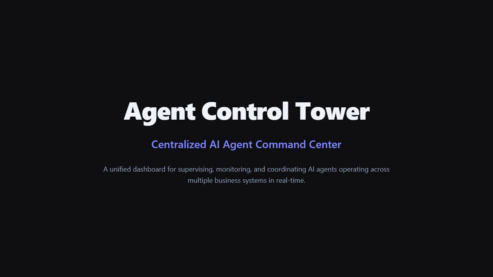

# Agent Control Tower

> **How do humans manage an AI workforce when agents can act across real systems?**

[](https://youtu.be/JI1OGZVuIls)
[](https://agentops-control-tower.vercel.app)
[](https://nextjs.org)
[](https://typescriptlang.org)

**Agent Control Tower** is a centralized command center for supervising AI agents operating across business systems — CRM, Email, WhatsApp, Calendar, and more. It provides humans with real-time visibility, human-in-the-loop approval controls, and complete audit governance over autonomous AI actions.

[](public/demo.mp4)

[▶ Watch the demo](https://youtu.be/JI1OGZVuIls) | [🌐 Live demo](https://agentops-control-tower.vercel.app)

---

## Key Features

### 🎮 Live Simulation Engine
Agents dynamically change status (Running, Waiting, Blocked) every few seconds. Tool calls appear in real time with progress bars. New audit events and approval requests are generated continuously — the dashboard feels truly operational.

### ✅ Human Approval Center
Agents request approval before executing high-risk actions. Humans see risk level, context, impact assessment, and alternatives — then Approve or Reject with one click. True human-in-the-loop control.

### 📊 Agent Hierarchy Graph
Visual tree showing CEO → Agent relationships with animated request flows. Status indicators show which agents are active, idle, or errored at a glance.

### 🔁 Mission Replay
Play, pause, step through the full execution timeline. Adjust replay speed (0.5x–4x). See every decision, action, and result in sequence.

### 🧠 AI Decision Log
When the system blocks an agent action, a transparent explanation panel shows:
- **Decision**: BLOCKED with policy reference
- **Confidence**: Score with progress bar
- **Reason**: Why it was blocked
- **Policy**: Exact policy violated
- **Recommended action**: How to resolve

### 📈 Executive KPIs
At-a-glance metrics panel:
- Active agents / Running tasks
- Success rate / Avg confidence
- Avg response time (ms)
- Human approval rate
- Blocked actions / Failed tasks
- Pending approvals / Active alerts

### 📱 Mobile Responsive
Fully responsive layout. Tab navigation scrolls horizontally on small screens. Cards reflow into 2-column grids on mobile.

---

## Dashboard Views

| Tab | Content |
|-----|---------|
| **Overview** | KPIs, Agent hierarchy graph, Approval center, AI decision log, Agent status cards, Trust scores, Charts (task history, distribution, confidence trend) |
| **Agents** | Intervention controls (pause/stop/resume), Agent boundaries, Agent communication |
| **Systems** | System connections (CRM, email, WhatsApp, etc.), Trust scores |
| **Activity** | Real-time activity feed, Event log, Agent communication |
| **Live** | Live agent monitor with tool calls, progress bars, and real-time event stream |
| **Replay** | Mission replay timeline with play/pause/step controls and AI decision explanations |

---

## Architecture

```
┌──────────────────────────────────────────────────────────────────────────┐
│                         Agent Control Tower                              │
├──────────────────────────────────────────────────────────────────────────┤
│                                                                          │
│  ┌──────────────────────────────────────────────────────────────────┐   │
│  │                    HUMAN INTERFACE LAYER                          │   │
│  │  Dashboard │ Approvals │ Graph │ Replay │ AI Log │ Live Monitor   │   │
│  └───────────────────────────────┬───────────────────────────────────┘   │
│                                  │                                        │
│  ┌───────────────────────────────┴───────────────────────────────────┐   │
│  │                     GOVERNANCE ENGINE                              │   │
│  │  Trust Scoring │ Boundary Enforcement │ Risk Assessment │ Audit    │   │
│  └───────────────────────────────┬───────────────────────────────────┘   │
│                                  │                                        │
│  ┌───────────────────────────────┴───────────────────────────────────┐   │
│  │                     SIMULATION ENGINE                              │   │
│  │  Agent Status Cycling │ Tool Call Generation │ Event Processing    │   │
│  └───────────────────────────────┬───────────────────────────────────┘   │
│                                  │                                        │
│  ┌───────────────────────────────┴───────────────────────────────────┐   │
│  │                     DATA LAYER                                    │   │
│  │  SQLite │ REST API (Next.js) │ Polling (5-15s)                    │   │
│  └───────────────────────────────────────────────────────────────────┘   │
│                                                                          │
└──────────────────────────────────────────────────────────────────────────┘
```

## Tech Stack

| Layer | Technology |
|-------|-----------|
| Framework | Next.js 16 (App Router) |
| Language | TypeScript 5 |
| Styling | Tailwind CSS 4 + shadcn/ui |
| Database | SQLite (better-sqlite3) |
| Charts | Recharts |
| Commands | cmdk |
| Deployment | Vercel (production) |
| CI | GitHub Actions |
| Container | Docker (multi-stage, healthcheck) |

## AI Agent Fleet

| Agent | Purpose | Key Systems |
|-------|---------|-------------|
| **Customer Support** | Handle inquiries, resolve complaints, manage tickets | CRM, Email |
| **Sales** | Qualify leads, send outreach, manage pipeline | CRM, Email, Calendar |
| **CRM** | Maintain records, enrich data, ensure hygiene | CRM, Database |
| **Email** | Process emails, classify, auto-respond | Email |
| **WhatsApp** | Handle messages, quick replies, order tracking | WhatsApp |
| **Scheduling** | Manage calendars, coordinate meetings | Calendar |

## Getting Started

```bash
git clone https://github.com/hafirhalima00-coder/agent-control-tower.git
cd agent-control-tower
npm install
npm run dev
```

Open [http://localhost:3001](http://localhost:3001)

### Production Build

```bash
npm run build
npm start
```

### Docker

```bash
docker compose up
```

## Design Principles

1. **Human Authority** — Humans always have final say over critical actions
2. **Transparency** — Every decision is explainable and auditable
3. **Graduated Trust** — Agents earn trust through consistent performance
4. **Fail-Safe Defaults** — Unknown actions require approval
5. **Complete Audit** — Every action is logged with full context

## Two-Year Thesis: Agent Operations as a Discipline

Within two years, **Agent Operations (AgentOps)** will become a distinct engineering discipline — the SRE layer of the AI agent era. Just as DevOps emerged from the convergence of development and operations, AgentOps will unite AI model management, real-time governance, and operational control into a cohesive practice.

Today, most organizations deploy AI agents as isolated tools — chatbots, copilots, automation scripts — without a unified control surface. This creates three critical gaps: **visibility** (no one sees what agents are actually doing across systems), **governance** (no mechanism to approve, audit, or block agent actions), and **containment** (no way to stop a misbehaving agent before it causes damage).

The Agent Control Tower model addresses all three. It provides a centralized command center where operators observe agent fleets in real time, enforce boundaries through approval queues and policy rules, and intervene instantly via kill switches when agents behave unexpectedly. This is not monitoring — it is operational control.

In two years, every organization running AI agents will need this layer. Regulators will require audit trails for agent decisions. Finance teams will demand cost attribution per agent task. Security teams will need per-agent permission boundaries. And operations teams will need real-time dashboards that show agent health, drift, and impact.

AgentOps tooling will evolve from today's fragmented approach — spreadsheets, logs, and ad-hoc scripts — into a professional discipline with standardized practices: agent lifecycle management, boundary-as-code, trust calibration, cost governance, and incident response for agent failures. The organizations that master this discipline will deploy AI agents confidently and at scale. Those that don't will face the consequences of uncontrolled autonomous action.

The Agent Control Tower is the cockpit for this new discipline.

## Compliance & Audit

All actions are logged with full context in the audit log. The audit trail includes:
- Agent identity and action taken
- Decision reasoning and confidence level
- Risk assessment and systems affected
- Human override status
- Timestamp and user attribution

Audit data can be exported via the `/api/audit` endpoint for compliance reporting and SIEM integration.

## License

MIT License - see [LICENSE](LICENSE)

---

> **built by Halima Hafir**
